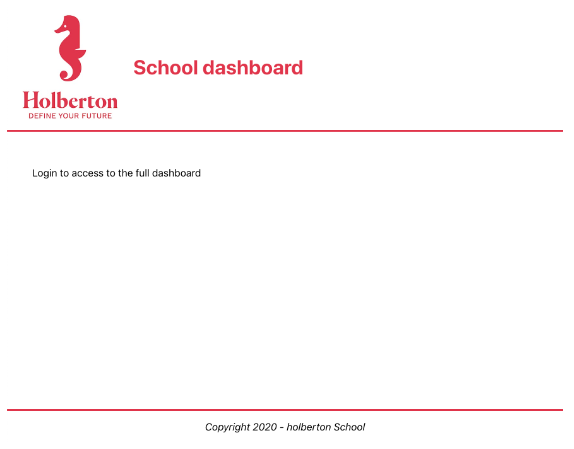
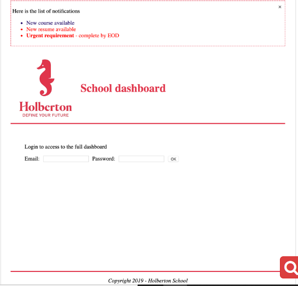

# 0x01. React intro (A revised edition of React intro by ALX)

This project consists of a number of tasks created to help understand the concept of building a simple application with React.

Also included is the concept of creating an application using Webpack.

Then, the icing on the cake is creating test files to test the codes written in different components of the application.

`Front-end` `JavaScript` `ES6` `React`

| 👩‍💻 By: Johann Kerbrat, Engineering Manager at Uber Works |
| -------------------------------------------------------- |


## Table of Contents

- [Introduction](https://github.com/Perpy-del/New-React#0x01-react-intro-a-revised-edition-of-react-intro-by-alx)

- [Resources](https://github.com/Perpy-del/New-React#resources)

- [Requirements](https://github.com/Perpy-del/New-React#requirements)

- [Tasks](https://github.com/Perpy-del/New-React#tasks)

  - [0. Basic application](https://github.com/Perpy-del/New-React#0-basic-application)
  - [1. Embedding expressions, functions](https://github.com/Perpy-del/New-React#1-embedding-expressions-functions)
  - [2. Modify the App](https://github.com/Perpy-del/New-React#2-modify-the-app)
  - [3. Modify the Notifications](https://github.com/Perpy-del/New-React#3-modify-the-notifications)
  - [4. Create basic tests with four tests](https://github.com/Perpy-del/New-React#4-create-basic-tests-with-four-tests)
  - [5. Install Enzyme](https://github.com/Perpy-del/New-React#5-install-enzyme)
  - [6. Create React tests](https://github.com/Perpy-del/New-React#6-create-react-tests)
  - [7. Deploy to a GitHub page](https://github.com/Perpy-del/New-React#7-deploy-to-a-github-page)
  - [8. Create a project using Webpack](https://github.com/Perpy-del/New-React#8-create-a-project-using-webpack)
  - [9. Install Babel](https://github.com/Perpy-del/New-React#9-install-babel)
  - [10. Reorganize the files](https://github.com/Perpy-del/New-React#10-reorganize-the-files)
  - [11. Testing](https://github.com/Perpy-del/New-React#11-testing)

## Resources

**Read or watch:**

- [React Official Website](https://reactjs.org/)
- [Getting started with React](https://www.taniarascia.com/getting-started-with-react/)
- [React overview](https://reactjs.org/docs/getting-started.html)
- [create-react-app](https://github.com/facebook/create-react-app)
- [React Developer Tools](https://chrome.google.com/webstore/detail/react-developer-tools/fmkadmapgofadopljbjfkapdkoienihi)
- [What is Babel?](https://babeljs.io/docs/)
- [Enzyme](https://enzymejs.github.io/enzyme/docs/api/shallow.html)

## Requirements

- All your files will be interpreted/compiled on Ubuntu 18.04 LTS using `node 12.x.x` and `npm 6.x.x`
- Allowed editors: `vi`, `vim`, `emacs`, `Visual Studio Code`
- All your files should end with a new line
- A `README.md` file, at the root of the folder of the project, is mandatory

## Tasks

### 0. Basic application

Create a basic app named dashboard using create-react-app in your task_0 directory

You will need a favicon and the Holberton logo. Download them and add them to the src/ directory under dashboard/

**Holberton Logo**


**Favicon**


**Remove the unused files:**

- `service-worker`
- `index.css`
- `App.test.js`

**in `task_0/dashboard/src/App.js`, create a function `App` that returns:**

- a header div with a class named `App-header` containing the Holberton logo and a h1 with the text `School dashboard`
- a body div with a class named `App-body` containing at least one paragraph with the text `Login to access the full dashboard`
  a footer div with a class named `App-footer` containing at least one paragraph with the text `Copyright 2020 - holberton School`

**Modify the App.css to make the project looks like the following screenshot:**



**Requirements:**

- When running, there should not be any lint error in the console

#### _Files: task_0/dashboards/src/, task_0/dashboard/src/App.css, task_0/dashboard/src/App.js_

### 1. Embedding expressions, functions

**Using your code from the previous task, in `task_1/dashboard/src/utils.js`:**

- Create a function named `getFullYear` that will return the current year
- Create a function named `getFooterCopy`:
- It accepts one argument `isIndex`(boolean). When true, the function should return `Holberton School`. When false, the function should return `Holberton School main dashboard`
- Modify the footer returned in `task_1/dashboard/src/App.js` to use these two functions

**in `task_1/dashboard/src/Notifications.js`, create a Notifications element:**

- It should import React
- It should export a function
- The function should return a `div` with the class `Notifications`
- The div should contain a paragraph with the text `Here is the list of notifications`
- import the file `Notifications.css`.

**in `task_1/dashboard/src/Notifications.css`, style the Notifications class:**

- Add a border and some padding around the `div`

**Render the Notifications element:**

- Modify `task_1/dashboard/src/index.js` to render the new element (`Notifications`) in a `div` named `root-notifications`
  Check that you can see the two elements on the browser, and using the React browser extension

**Requirements:**

- When running, there should not be any lint error in the console

#### _Files: task_1/dashboard/src/, task_1/dashboard/src/utils.js, task_1/dashboard/src/App.js, task_1/dashboard/src/Notifications.css, task_1/dashboard/src/Notifications.js, task_1/dashboard/src/index.js_

### 2. Modify the App

**using your code from the previous task, in task_2/dashboard/src/App.js under the paragraph that says `Login to access the full dashboard`:**

- add a label and input for email
- add a label and input for password
- when the user clicks on a label, it should select the corresponding input
- add one button element with the text “OK”

#### _Files: task_2/dashboard/src/, task_2/dashboard/src/App.js_

### 3. Modify the Notifications

**in task_2/dashboard/src/utils.js:**

- Create a function named `getLatestNotification` that returns the following string: `<strong>Urgent requirement</strong> - complete by EOD`

**in `task_2/dashboard/src/Notifications.js` in the Notifications div:**

- add a button element with inline styling (without using the CSS file):
- show button on right side of notifications box
- `aria-label` is `Close`
- when user clicks on the button it logs to the console `Close button has been clicked`
- in the button element add a children `img` element that will import the `close-icon.png` image
- after the paragraph add an unordered list
- the list has the following items:
- The first one has a default priority and says `New course available`
- The second one has a urgent priority and says `New resume available`
- Add the priority to the first and second items of the list using a `data` attribute
- The last item correctly displays the content of `getLatestNotification` using `dangerouslySetInnerHTML`

**in `task_2/dashboard/src/Notifications.css`:**

- style the notification priorities using their data attribute: set the color of default items to blue, and the color of urgent items to red.

**Requirements:**

- When running, there should not be any lint error in the console
- Your app should look like the following screenshot:



#### _Files: task_2/dashboard/src/, task_2/dashboard/src/utils.js, task_2/dashboard/src/Notifications.js, task_2/dashboard/src/Notifications.css_

### 4. Create basic tests with four tests

**in `task_3/dashboard/src/utils.test.js`:**

- Write a test to check that the function `getFullYear` returns the correct year (be careful to not create a time bomb)
- Write a test to check that `getFooterCopy` returns the correct string when the argument is true or false
- Write a test checking the returned string for `getLatestNotification`

#### _Files: task_3/dashboard/src/utils.test.js_

### 5. Install Enzyme

- Install Enzyme with `npm`
- Create a file named `setupTests.js` and configure the adapter for Enzyme

#### _Files: task_3/dashboard/src/setupTests.js_

### 6. Create React tests

**in `task_3/dashboard/src/App.test.js` create four tests:**

- test that App renders without crashing
- verify that App renders a div with the class `App-header`
- verify that App renders a div with the class `App-body`
- verify that App renders a div with the class `App-footer`

**in `task_3/dashboard/src/Notifications.test.js` create three tests**

- test that Notifications renders without crashing
- verify that Notifications renders three list items
- verify that Notifications renders the text `Here is the list of notifications`

**Requirements:**

- When running the test suites, you should see the following result
- You must use shallow rendering to write the React tests

```bash
Test Suites: 3 passed, 3 total
Tests: 11 passed, 11 total
```

#### _Files: task_3/dashboard/src/App.test.js, task_3/dashboard/src/Notifications.test.js_

### 7. Deploy to a GitHub page

Deploy your application to GitHub Pages using `gh-pages` branch and `create-react-app`

Your application should be working correctly when accessing the GitHub URL.

**Here is my URL: [https://perpy-del.github.io/](https://perpy-del.github.io/)**

### 8. Create a project using Webpack

Without reusing create-react-app or the code from the previous exercise, start a brand new npm project

Reusing what you learned during the Webpack module:

- Set up a system to output a `bundle.js` file in a `dist` folder
- Set up a dev server with hot reloading
- Create a `src` folder that will contain your Javascript
  Set up a simple html file in the `dist` folder that will import the bundle file in the `body` tag.
  Install and configure the various plugins to support:

- inline source map
- style loader
- css loader
- image webpack loader

#### _File: task_5/dashboard/config/webpack.config.js, task_5/dashboard/dist/index.html, task_5/dashboard/src/index.js_

### 9. Install Babel

- Install Babel, and in `task_5/dashboard/.babelrc`, add the presets for `preset-env` and `preset-react`
- Add a `babel-loader` to the Webpack configuration so you can support `js` and `jsx` files
- Import the files that you wrote in the previous task. All the Javascript and React code should be within the `src` folder

At this point, running `webpack-dev-server` should correctly execute your code, and you should be able to see the dashboard like in the last task.

#### _Files: task_5/dashboard/.babelrc, task_5/dashboard/config/webpack.config.js_

### 10. Reorganize the files

Let’s reorganize the files in our project:

- Every file related to the App, should be within a `App` folder
- Every file related to the Notifications, should be within a `Notifications` folder
- Every file related to the utils functions, should be within a `utils` folder
- Every asset file should be within the `assets` folder
- Set up the `favicon.ico` in the `dist` folder
- Webpack config file should be within a `config` folder if it isn’t already

#### _Files: task_5/dashboard/src/App/App.css, task_5/dashboard/src/App/App.js, task_5/dashboard/src/App/App.test.js, task_5/dashboard/src/Notifications/Notifications.css, task_5/dashboard/src/Notifications/Notifications.js, task_5/dashboard/src/Notifications/Notifications.test.js, task_5/dashboard/src/utils/utils.js, task_5/dashboard/src/utils/utils.test.js, task_5/dashboard/config/webpack.config.js, task_5/dashboard/src/assets/holberton-logo.jpg, task_5/dashboard/dist/favicon.ico_

### 11. Testing

Install Jest and Enzyme to run your test suites

move the `setupTests.js` file to `config` folder if you have not already

**Requirements:**

- Your package.json should have the two following scripts:
  "start": "webpack-dev-server --mode development --config config/webpack.config.js",
  "test": "jest"

- Running the first script should start your dev server and build without any error
- Running the second script should start your test suites and pass for each test

#### _Files: task_5/dashboard/config/setupTests.js, task_5/dashboard/package.json_
