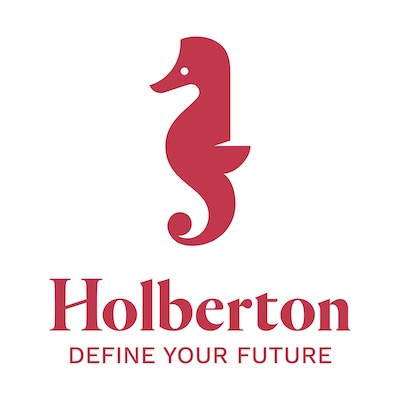

# 0x01. React intro (A revised edition of React intro by ALX)

This project consists of a number of tasks created to help understand the concept of building a simple application with React.

Also included is the concept of creating an application using Webpack.

Then, the icing on the cake is creating test files to test the codes written in different components of the application.

| Front-end | JavaScript | ES6 | React |

| 👩‍💻 By: Johann Kerbrat, Engineering Manager at Uber Works |
| -------------------------------------------------------- |

## Resources

**Read or watch:**

- [React Official Website](https://reactjs.org/)
- [Getting started with React](https://www.taniarascia.com/getting-started-with-react/)
- [React overview](https://reactjs.org/docs/getting-started.html)
- [create-react-app](https://github.com/facebook/create-react-app)
- [React Developer Tools](https://chrome.google.com/webstore/detail/react-developer-tools/fmkadmapgofadopljbjfkapdkoienihi)
- [What is Babel?](https://babeljs.io/docs/)
- [Enzyme](https://enzymejs.github.io/enzyme/docs/api/shallow.html)

## Requirements

- All your files will be interpreted/compiled on Ubuntu 18.04 LTS using `node 12.x.x` and `npm 6.x.x`
- Allowed editors: `vi`, `vim`, `emacs`, `Visual Studio Code`
- All your files should end with a new line
- A `README.md` file, at the root of the folder of the project, is mandatory

## Tasks

### 0. Basic application

Create a basic app named dashboard using create-react-app in your task_0 directory

You will need a favicon and the Holberton logo. Download them and add them to the src/ directory under dashboard/

**Holberton Logo**

**Favicon**

